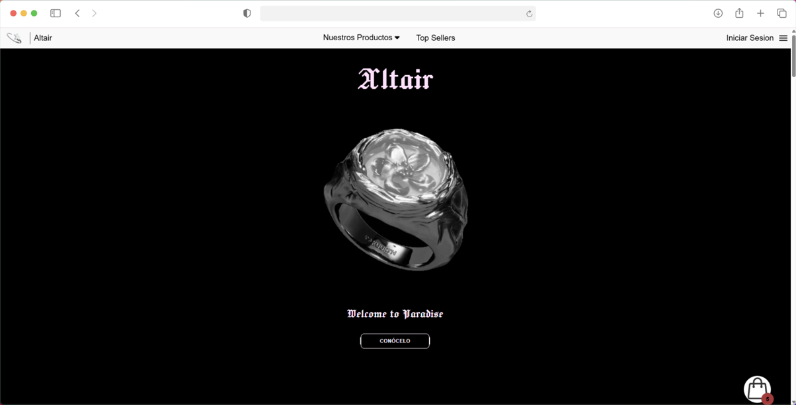
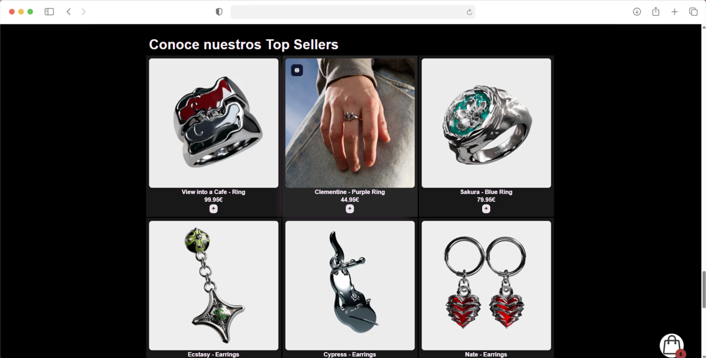
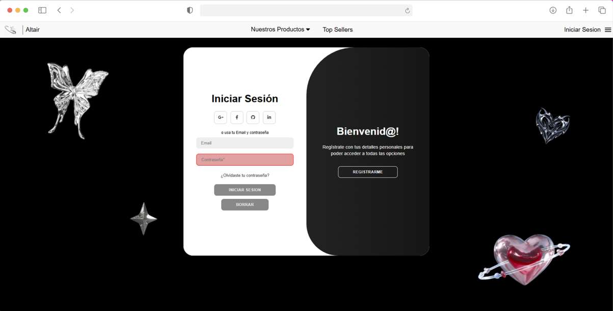

# Altair - Tienda Online de Joyería

Este proyecto es una aplicación web de comercio, desarrollada como ejercicio práctico para aprender y consolidar los principios fundamentales de **JavaScript**, la manipulación del **DOM** y practicar técnicas avanzadas de **CSS**.

---

## Características

* **Catálogo Dinámico:** Los productos se generan automáticamente desde un array de objetos en JavaScript, facilitando el mantenimiento.
* **Sistema de Carrito:**
    * Añadir productos y calcular el total automáticamente.
    * Vaciar el carrito de un solo click.
    * **Persistencia de datos:** Los productos guardados no se borran al recargar la página gracias al uso de `localStorage`.
* **Filtrado Inteligente:** Sistema de filtros para clasificar joyas por categorías (Anillos, Pendientes, Collares).
* **Interfaz de Usuario (UI) Avanzada:**
    * **Navbar Adaptativo:** La barra de navegación se oculta al hacer scroll hacia abajo y aparece al subir para mejorar la visibilidad.
    * **Sidebar Responsive:** Menú lateral desplegable para dispositivos móviles.
    * **Formulario Interactivo:** Sistema de Login/Registro con transiciones animadas de panel mediante clases de CSS.

## Tecnologías

* **HTML5:** Estructura semántica y formularios.
* **CSS3:** * **Flexbox y CSS Grid** para el diseño del catálogo.
    * **Keyframes** para las animaciones de los formularios.
    * **Media Queries** para asegurar que sea responsivo.
* **JavaScript (Vanilla):**
    * Manipulación del DOM para renderizar productos.
    * Gestión de eventos (`EventListener`).
    * Uso de `JSON.parse` y `JSON.stringify` para el almacenamiento local.
 del Proyecto

```
├── css/
│   ├── style.css       # Estilos base y variables globales
│   ├── principal.css   # Estilos del catálogo y carrito
|   ├── preguntas.css   # Estilos del apartado de Preguntas frecuentes
│   └── formulario.css  # Animaciones y diseño del login/registro
├── js/
│   ├── carrito.js      # Lógica del motor de ventas y localStorage
│   ├── script.js       # Manejo del "click" sobre el NAV
│   └── script2.js      # Manejo del NAV desplegable
├── img/                # Recursos visuales y fotografías de productos
├── svg/                # Iconos
├── html/
│   ├── index.html       # Página principal. Hero y catálogo
│   ├── formulario.html  # Apartado de Inicio de Sesión
│   └── preguntas.html   # Apartado de preguntas frecuentes para el usuario

```

## Aprendizaje

Durante el desarrollo de **Altair**, he logrado dominar:

* **Gestión de Estados:** Controlar qué productos están en el carrito y cómo se reflejan en la interfaz en tiempo real.
* **Experiencia de Usuario (UX):** Crear una navegación fluida mediante scripts que detectan el movimiento del usuario (como el navbar inteligente).
* **Organización de Código:** Separar la lógica de negocio (carrito) de la lógica de interfaz (animaciones) en diferentes archivos JS para mejorar la mantenibilidad.

---

### Autora
Proyecto creado por **Irene Smykla Jiménez** para el aprendizaje en el desarrollo Frontend.

> [!NOTE]
> Para iniciar en navegador, abrir index.html (es la página de inicio).

### Imágenes del proyecto:

**Inicio:**

**Productos:**

**Inicio de Sesión:**


